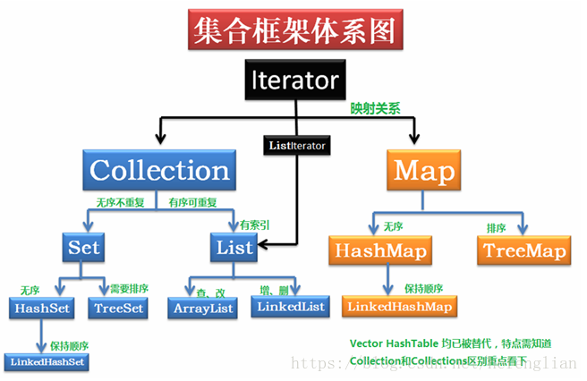
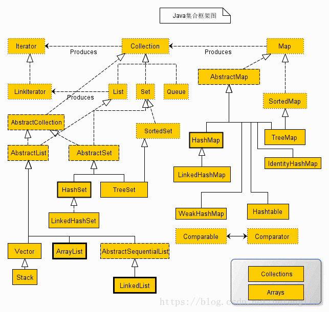

# java集合
# 菜鸟参考地址
[菜鸟参考地址](https://www.runoob.com/java/java-collections.html)
# 源码仓库
[源码学习仓库](https://gitee.com/cyuxuan/learn-java-source)
## java集合分类
1. 线性表
2. Map（键值对映射）
## java集合框架体系图

## java集合框架体系图2

## 详细
### Collection接口实现类的特点
- 首相明确 Collection<E>是一个接口 它继承了Iterable<E>接口
1. Collection接口的实现子类可以存放多个元素，每个元素可以是Object
2. Collection的实现类，有些是有序的(List)，有些是无序的(Set)
3. Collection的实现类，有些可以存放重复的元素，有些不可以
4. Collection接口没有直接实现的子类，是通过它的子接口Set和List来是现实的

## List（详情参考分支上的y源码，源码中有详细注释）
1. List接口实现的子类，存放的元素集合一定是有序的，与放入顺序一直。
### ArrayList
1. ArrayList中可以存放null。
2. ArrayList是由数组来实现数据存储的。
3. ArrayList基本等同于Vector，但是ArrayList是线程不安全（但是执行效率高）的，多线程情况下，不建议使用。
4. 关于什么时候需要扩容
   1. 所需要的最小容量大于当前数组实际长度（容量）时
5. 扩容为1.5倍。逻辑为
   1. 首先按照当前的数组length,实际容量来进行扩容。
   2. 检查，如果发现当前扩容的容量小于传入的所需最小容量，则直接使用传入的所需最小容量。
   3. 检查，如果扩容后的容量超过了定义的集合最大容量
      1. 检查所需的最小容量是否小于定义的集合最大容量，如果是，则使用定义的集合最大容量进行扩容
      2. 如果所需的最小容量超过了定义的集合最大容量，则使用Integer最大值，进行扩容

### Vector
1. Vector扩容时按照2倍进行扩容
