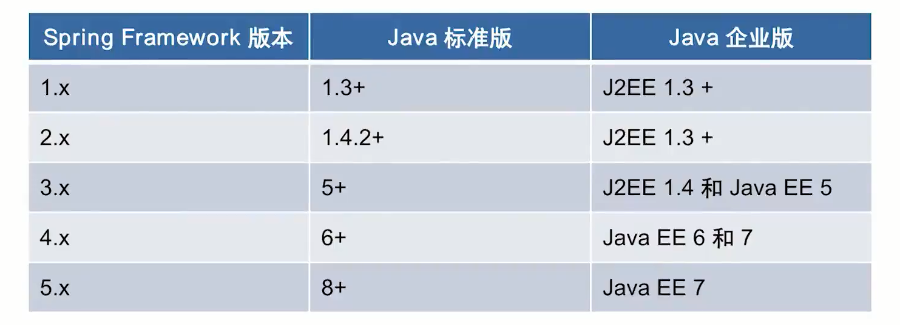
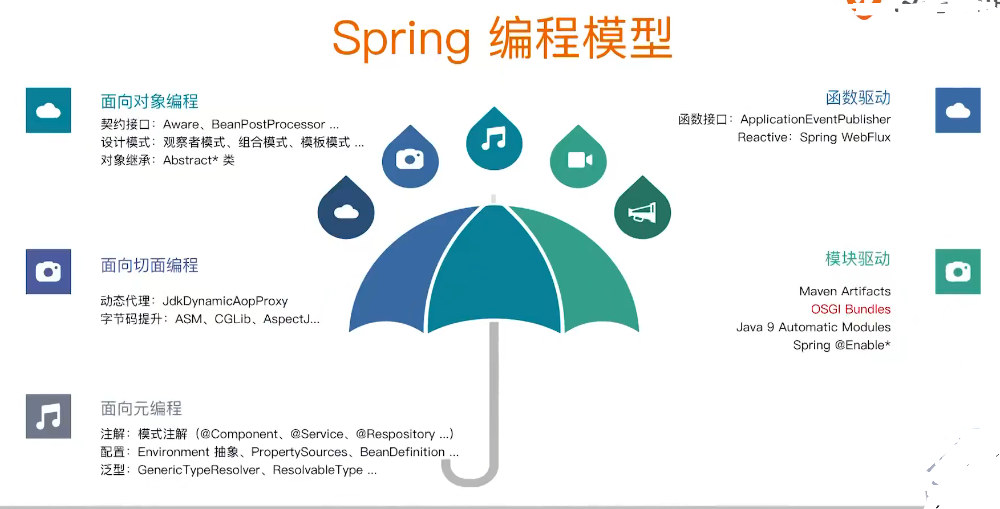

# Spring基础
## Spring总览
- 特性总览
- 版本特性
- 技术整合
  - Java语言特性运用
  - JDK API实践
  - Java EE API整合
- 变成模型
  - 面向对象编程
    - 契约接口(接口)
      - 这里就是面向接口编程
  - 面向切面编程
    - 动态代理
      - 在Java中动态代理必须基于接口来进行编程，实际情况可能并不允许完全基于接口进行编程。因此Spring提升了一种方式。整合了第三方框架，例如ASM，CGLIB,AspectJ来帮助我们在类上做提升。帮助我们可以在某个类上面做一些AOP的拦截
    - 字节码提升
  - 面向元编程
    - 配置元信息
    - 注解
    - 属性配置
  - 面向模块编程
    - Maven Artifacts
    - Java9 Automatic Modules
    - Spring @Enable* 注解
  - 面向函数编程
    - Lambda
    - Reactive
      - 异步非阻塞

## Spring核心特性
### IOC容器
### Spring事件
### 资源管理
### 国际化
### 校验
### 数据绑定
### 类型转换
### Spring表达式
### 面向切面编程(AOP)

## 数据存储
### JDBC
### 事务抽象
### DAO支持
### O/R映射
### XML编列

## Web技术
- SpringMVC与Spring WebFlux在注解上完全一样，但是底层实现发生了变化
- 传统的SpringMVC需要Servlet引擎支持，Reactive通常默认情况下是netty的web server
- Reactive也可以运用Spring MVC的引擎来进行实现
### Web Servlet 技术(Spring 1-4 唯一支持)
#### Spring MVC
#### WebSocket
- Servlet3.0以后会支持WebSocket
#### SockJS

### Web Reactive 技术(Spring5 以后引入)
#### Spring WebFlux
#### WebClient
- 将HttpClient和RestTemplate这两个同步的调用，变成异步回调
#### WebSocket

## 技术整合
### 远程调用(Remoting)
- RMI java标准的远程调用
- Dubbo 基于Hessian协议，Hessian是社区开源方案
- Spring Framework做了一层封装，无论是HTTP的调用还是Hessian的调用都可以通过这个统一的封装来执行调用得到结果
- 远程调用一般是同步模式
### Java消息服务(JMS)
- java异步的调用
- 使用传统的JMS规范来实现，不包括RabbitMQ，kafka,因为这些不是规范的JMS实现
### 连接框架(JCA)
- 主要是作用是统一一些资源连接
- 比如JDBC这样的连接
- 目前使用得很少了
### Java管理扩展(JMX)
- Java Management Extensions
- 用于Java的管理，比如CPU使用率查看等
- Spring1.2引入了一个注解 @ManagedResource
### 邮件客户端(Email)
### 本地任务(Tasks)
### 本地调度(Scheduling)
### 缓存抽象(Caching)
### Spring 测试(Testing)

## Spring 测试
### 模拟对象(Mock Objects)
### TestContext框架(TestContext Framework)
### Spring MVC测试(Spring MVC Test)
### Web 测试客户端(WebTestClient)

## Spring 各版本与Java的关系

- Java1.3版本对应Servlet2.3版本，该版本对应一个Servlet事件，可以和Spring时间进行一个呼应。
- Servlet事件和Spring事件都是Java标准事件的一个实现

## Spring模块化设计
- spring-aop
- spring-aspects
- spring-context-indexer
- spring-context-support
- spring-context
- spring-core
- spring-expression
- spring-instrument
- spring-jcl
- spring-jdbc
- spring-jms
- spring-messaging
- spring-orm
- spring-oxm
- spring-test
- spring-tx
- spring-web
- spring-webflux
- spring-webmvc
- spring-websocket

## Spring 对java EE API整合
- 暂时省略

## Spring 编程模型
- 
### 面向对象编程
- 契约接口
  - Awear
  - BeanPostProcessor
    - 关于Bean的生命周期的后置处理
- 设计模式
  - 举例
    - 观察者模式
      - ApplicationEvent(Spring事件)
      - Spring事件是基于Java的标准事件，EventObjec对象java.uti包下
      - 有一个简单实现，SimpleApplicationEventMulticaster，简单应用事件的广播器，这里就使用了观察者模式
    - 组合模式
      - CompositeCacheManager，使用的组合模式
    - 模板模式
      - 例如jdbcTemplate
  - 对象继承
    - Abstract*类
      - 举例
      - AbstractBeanFactory
### 面向切面编程
- 动态代理
- 字节码提升
### 面向元编程
- 注解
- 配置
- 泛型
### 函数驱动

### 模块驱动

## 重新认识IOC
### IOC的职责
- 实现与执行直接要产生解耦
- 要关注设计的目标而不是具体的实现
- 释放模块，不依赖于某个契约
- 当模块取消的时候，应对边缘效应或者副作用

### 一些问题
- Spring作为IOC容器有什么优势
  - 典型的IoC管理，依赖查找和依赖注入
  - AOP抽象
  - 事务抽象
  - 事件机制
  - SPI扩展
  - 强大的第三方整合
  - 易测试性
  - 更好的面向对象